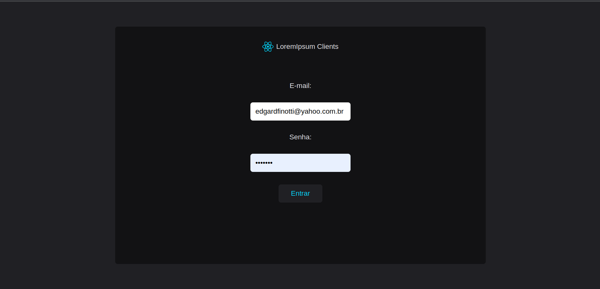
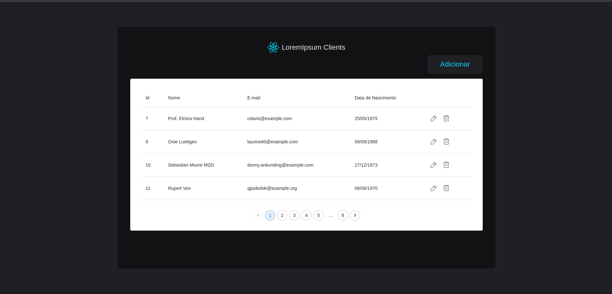
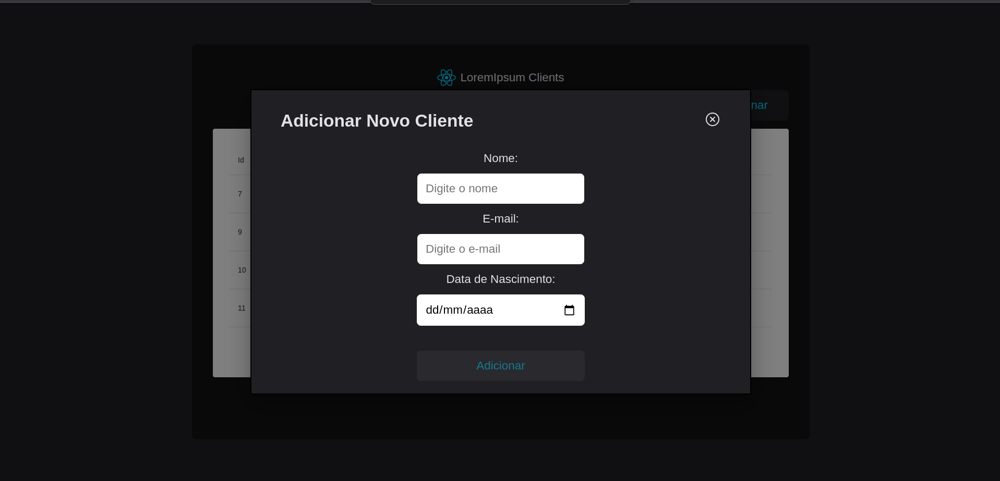
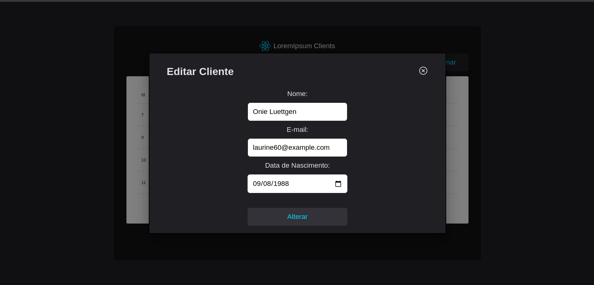

<h4 align="center"> 
	🚀 Cadastro de clientes 1.0 🚀
</h4>

[](https://github.com/edgardfn/Cadastro_CLientes_Laravel_ReactJS/blob/main/LICENSE) 

## 💻 Sobre o projeto

Codastro de Clientes 🚀 - é um sistema de cadastro de clientes, com tela para realizar login, tela de clientes com listagem de clientes com paginação, funcionalidade de adicionar novos clientes, editar cliente e excluir um cliente.


## 🎨 Layout

  

  

  

    


## 🛠 Tecnologias

- [ReactJS]
- [Typescript]
- [React Router DOM]
- [Styled Components]
- [Context API]
- [Axios]
- [Phosphor Icons]
- Material UI
- Laravel
- Php

## 🚀 Como executar o projeto

### Pré-requisitos

#### Front-End:
Antes de começar, você vai precisar ter instalado em sua máquina as seguintes ferramentas:
[Git](https://git-scm.com), [Node.js][nodejs]. 
Além disto é bom ter um editor para trabalhar com o código como [VSCode][vscode]

```bash
# Clone este repositório
$ git clone https://github.com/edgardfn/cofee_delivery.git](https://github.com/edgardfn/Cadastro_CLientes_Laravel_ReactJS.git

# Acesse a pasta raiz do projeto do front no seu terminal/cmd
$ cd front-end

# Instale as dependências
$ npm install

# Execute a aplicação em modo de desenvolvimento
$ npm run start

```

#### Back-End:

```bash
# Acesse a pasta raiz do projeto do front no seu terminal/cmd
$ cd back-end

#Criar databe no mysql 'api_clientes'

#Rodar as migrations:
$ php artisan migrate

#Rodar os Seeders:
$ php artisan db:seed

#Gerar uma nova key:
$ php artisan key:generate

#Iniciar servidor dev do projeto:
$ php artisan serve

```

## 📝 Licença

Este projeto esta sobe a licença MIT.

Feito com ❤️ por Edgard Finotti Neto 👋🏽 [Entre em contato!](https://www.linkedin.com/in/edgard-finotti-neto-a258b21a2/)

[nodejs]: https://nodejs.org/
[Typescript]: https://www.typescriptlang.org/
[expo]: https://expo.io/
[ReactJS]: https://reactjs.org
[rn]: https://facebook.github.io/react-native/
[yarn]: https://yarnpkg.com/
[vscode]: https://code.visualstudio.com/
[vceditconfig]: https://marketplace.visualstudio.com/items?itemName=EditorConfig.EditorConfig
[license]: https://opensource.org/licenses/MIT
[vceslint]: https://marketplace.visualstudio.com/items?itemName=dbaeumer.vscode-eslint
[prettier]: https://marketplace.visualstudio.com/items?itemName=esbenp.prettier-vscode
[Rocketseat]: https://rocketseat.com.br
[Styled Components]: https://styled-components.com/
[React Router DOM]:https://github.com/remix-run/react-router
[React Hook Form]:https://github.com/react-hook-form/react-hook-form
[Validação de Formulários com Biblioteca Zod]:https://github.com/colinhacks/zod
[ViaCEP]:https://viacep.com.br/
[Axios]: https://github.com/axios/axios
[Phosphor Icons]: https://github.com/phosphor-icons/react
[React Input Mask]: https://github.com/sanniassin/react-input-mask
[UUID]: https://github.com/uuidjs/uuid
[Context API]: https://reactjs.org/docs/context.html
[Redux]: https://react-redux.js.org/
[Effect Hook]: https://reactjs.org/docs/hooks-effect.html
